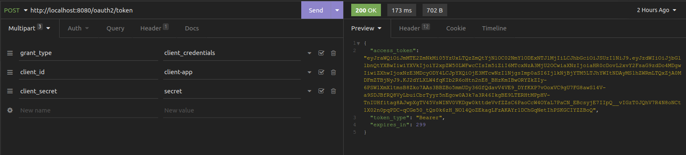

## Spring Security OAuth2 Authorization Server

Projeto Java com Spring com implementação simples de um Authorization Server utilizando o spring-boot-starter-oauth2-authorization-server

---
### Testando o projeto

---
#### Client-credentials flow

1. Rode o projeto.

2. Obtenha o token configurando o grant_type para client_credentials e demais campos conforme imagem abaixo:



#### Authorization-code flow

1. Rode o projeto

2. Obtenha um code challenge pkce neste [link](https://developer.pingidentity.com/en/tools/pkce-code-generator.html)

3. Altere a url abaixo substituindo o {code-challenge} pelo código gerado no passo anterior.

```
http://localhost:8080/oauth2/authorize?client_id=client-app&response_type=code&scope=openid&redirect_uri=http%3A%2F%2F127.0.0.1%3A8083%2Flogin%2Foauth2%2Fcode%2Fclient-app&code_challenge={code-challenge}&code_challenge_method=S256
```

4. Em uma aba do navegador, cole o url acima e você será redirecionado para uma tela de login do spring.


5. Entre com usuário e senha configurado no projeto
> username: user </br>
> password: 123456
 
6. Você será redirecionado para um endereço url que conterá o code gerado pelo authorization server

7. Copie o code desta url para ser utilizado no próximo passo.

8. Configure o grant_type para authorization_code. Utilize o code do passo anterior no campo code da requisição, e, no campo code_verifier, cole o código gerado no passo 2.


